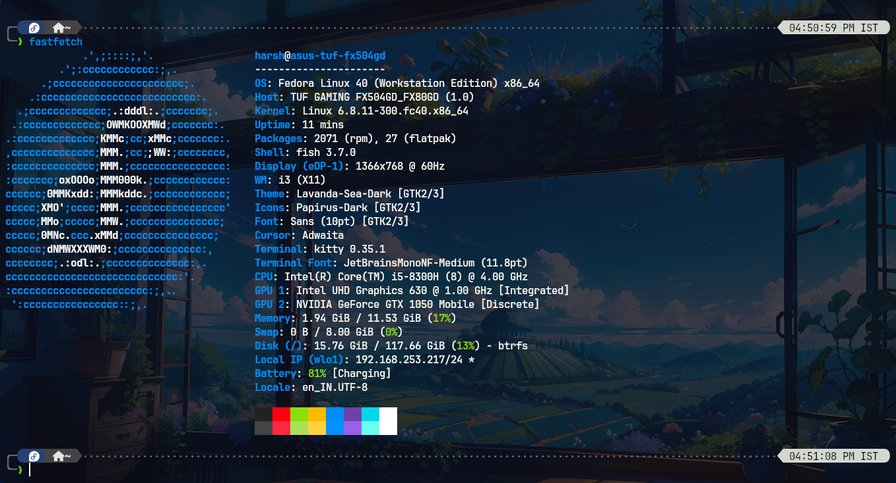
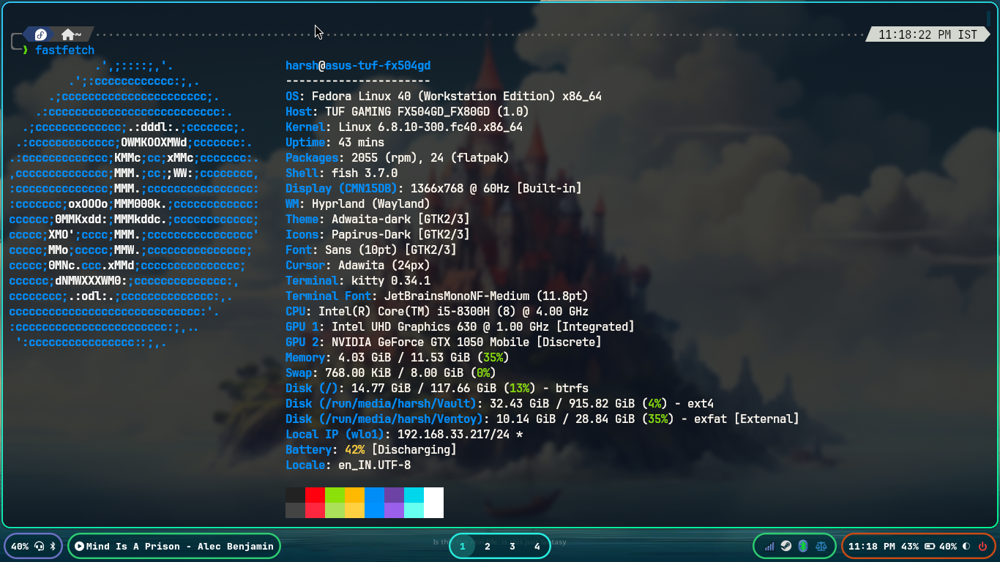

# Window Manager Setup

Just run `setup.sh` and the script will take care of the rest.
You need to make sure that the clone location of repository is `~/GitHub/wm`, otherwise the script will fail.

## i3

## Polybar

## Hyprland

## Waybar

